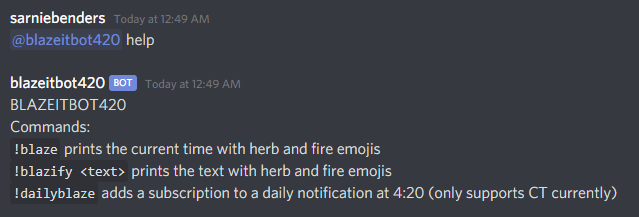

# blazeitbot420
A Discord bot. [Invite me to your server <3](https://discordapp.com/api/oauth2/authorize?client_id=685938555360641050&permissions=10240&scope=bot)

## Commands:
### `@blazeitbot420 help`
*prints this help text*

### `!blaze`
*prints the current time with herb and fire emojis*

### `!blazify <text>`
*prints the text with herb and fire emojis*

### `!dailyblaze`
*adds a subscription to a daily notification at 4:20 (only supports CT currently)*

